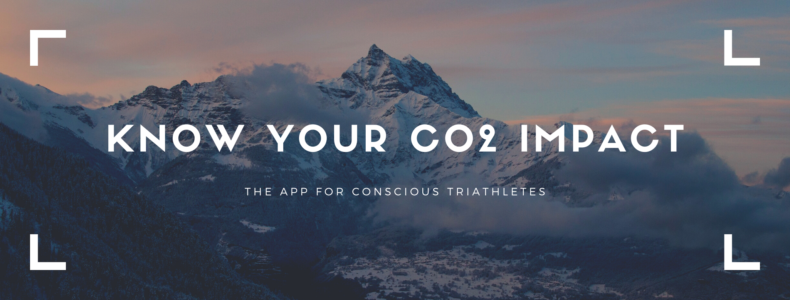

# Carbon & Lactate

> Digitales Gesellenstück as final project for neuefische web dev bootcamp

## `Description`

### An app for the sustainable triathlete / athlete

Triathletes like to travel for their sports: They participate in events around the world. The app should allow them to have their carbon footprint profile visualized. Additionally, their sports activities will be added to their carbon account so that they can work to better their carbon footprint balance.

### `Demo`

You can find the hosted version on firebase:
[Demo Version](https://capstone-project-c74dc.web.app/)

## `Tech Stack`

- React
- React Hooks
- React Router
- Express
- Axios
- Firebase
  - Authentication
  - Database
  - Hosting
  - Cloud Functions
- PropTypes
- Styled Components
- react-spring
- Storybook
- React Testing Library
- Jest
- Cypress Tests

## `Project setup`

1. Clone this repository.
2. Install all npm dependencies

   `npm install`

3. To run the app in development mode npm start, then open http://localhost:3000 to view it in the browser
4. To run Storybook
   `npm run storybook`
5. To run unit and component tests
   `npm test`
6. To run Cypress tests
   `npm run cypress`
7. Create a build ready for deployment to firebase
   `npm run build`
8. Install firebase (this app uses firebase for authentication and backend functions)
   `npm install -g firebase-tools`
   Next initialized firebase to use and deploy the firebase project.
